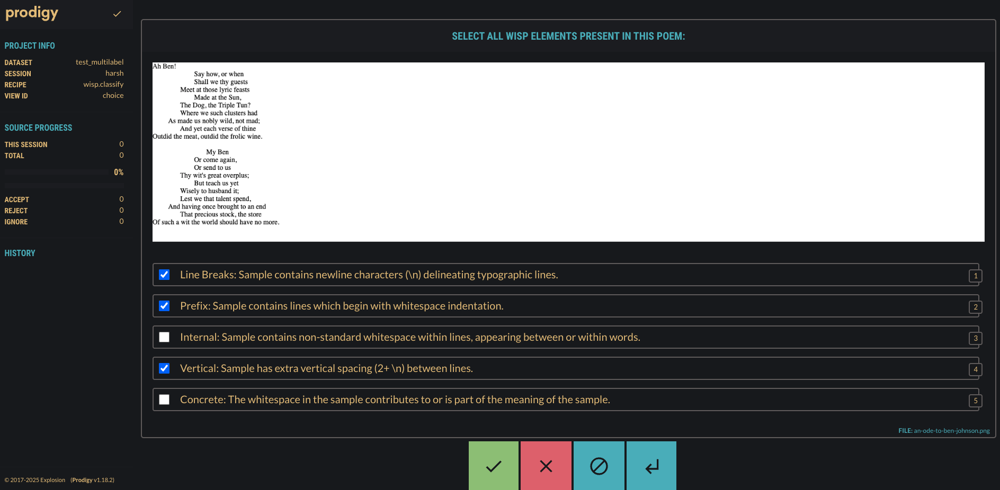
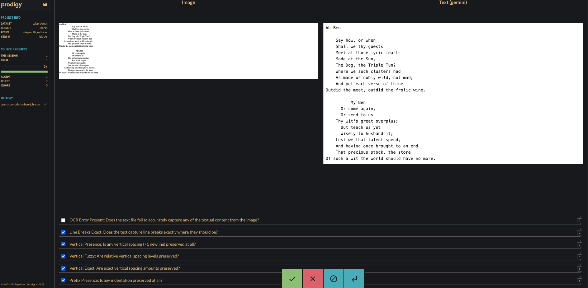

# WISP-Bench

WISP-Bench consists of a three-tiered set of pass-or-fail unit-tests, each of which asks: *Given the ground truth image of the poem, does the linearized text accurately capture a specific whitespace property?*  This design was inspired by [olmOCR-bench](https://huggingface.co/datasets/allenai/olmOCR-bench); the unit test guidelines are in the appendix of our paper *and* this README. [^1]

We retrieve ground truth images of relevant poems by converting Poetry Foundation webpages to images. For copyright reasons, we can share neither the original webpages nor the screenshotted images. Please make sure to add relevant images from your own dataset to `poem_images` in order to run the benchmark. 

## Prodigy Recipes for WISP-Bench

We use [Prodigy](https://prodi.gy/) as our annotation tool for the manual two-task benchmarking of linearization methods. Unfortunately, it is a one-time license purchase, so we cannot share the tool itself. However, we can share the Prodigy recipes (Python code) that we used to set up the annotation tasks.

### Task I: Label-Balanced Classification and Selection of 76 Poems
It is not possible to annotate all of the poems in our dataset; one of the challenges of this task is that it can't be reliably automated, either. Hence, we needed to select a much smaller subset to enable feasible manual annotation, a subset that maximizes presence and distribution of different WISP labels to avoid skewing towards a few dominant labels.

To achieve this, we first set up the annotation task `wisp-label-classification.py` over 1000 randomly selected poems, where we manually labeled each poem's image with all applicable WISP labels. The annotation task produces a JSONL file where each line is an annotation; we run the script `wisp_mapping.py` to extract a mapping of WISP labels to poem slugs. Finally, we run a selection script `shortlist.py` that picks a shortlist of poems such that each WISP label `l` is represented by at least `l_i` (a predefined number) of poems, and the overall distribution of labels is as balanced as possible.

<p align="center">
    
</p>


```bash
$ cd 3-wisp-bench/i-label-classification/
$ prodigy wisp.classify wisp_multilabel \
    ../poem_images -F \
    ../prodigy-recipes/wisp-label-classification.py --remove-base64  # set up prodigy annotation server and annotate
Added dataset test_multilabel to database SQLite.

✨  Starting the web server at http://0.0.0.0:9000 ...
Open the app in your browser and start annotating!
# NOTE: Open the URL with the session variable pointing to the annotator for tracking
# e.g. the screenshot is from http://0.0.0.0:9000?session=harsh

$ prodigy db-out wisp_multilabel > wisp_classifications.jsonl  # once done, export annotations to a JSONL file
$ python3 wisp_mapping.py wisp_classifications.jsonl # extract mapping of WISP labels to poem slugs
$ python3 shortlist.py -l 20 -v 20 -p 20 -i 20 --input wisp_mapping.json  # generate a shortlist of poems with at least 20 poems per label
```

For our benchmark, we set the minimum number of poems per label at 20, resulting in a shortlist of 76 poems. We cannot share the poems themselves due to copyright restrictions.

### Linearization Methods: Image -> Text w/ Multimodal LLM OCR

We have mentioned the configuration parameters of `resiliparse`, `trafilatura`, and `justext` in the paper. These are HTML to text linearization methods. We also use the ground truth images of poems to generate text using multimodal LLM OCR capabilities.We use three different models: Gemini, Claude, and OpenAI. The code to run the OCR is in `2-wisp-bench/ii-wisp-bench/llm_ocr.py`, and uses the same prompt as mentioned in the appendix of our paper.


#### Installation

```bash
# Gemini
$ pip install google-generativeai pillow
# Claude  
$ pip install anthropic
# OpenAI
$ pip install openai
```

Set the appropriate API key for chosen model with environment variables:

```bash
$ export GEMINI_API_KEY="your_gemini_key_here"
$ export ANTHROPIC_API_KEY="your_claude_key_here" 
$ export OPENAI_API_KEY="your_openai_key_here"
```

#### Usage

```bash
# Gemini / uses 'gemini-2.5-pro-preview-06-05'
$ python llm_ocr.py --model gemini # default paths
$ python llm_ocr.py --model gemini --input /path/to/images --output /path/to/results

# Claude / uses 'claude-sonnet-4-20250514'
$ python llm_ocr.py --model claude # default paths
$ python llm_ocr.py --model claude --input /path/to/images --output /path/to/results

# OpenAI / uses 'o3-2025-04-16'
$ python llm_ocr.py --model openai # default paths
$ python llm_ocr.py --model openai --input /path/to/images --output /path/to/results
```

Default parameters:
- Input directory: `../poem_images/` (relative to script location)
- Output directory: `./poem_texts/{model}/` (relative to script location)
- Supported formats: `.png`, `.jpg`, `.jpeg`, `.webp`

### Task II: WISP-Bench 

For each of the 76 poems in our shortlist, we then set up the annotation task `wisp-sublevel-annotation.py` where annotators evaluate the output of the linearization methods against the ground truth image using the WISP-Bench unit tests. Once done, export the annotations to a JSONL file and run `benchmark.py` to generate benchmark scores and analysis, and `visualize.py` to generate visualizations from the benchmark results.

<p align="center">
    
</p>

```bash
$ cd 3-wisp-bench/ii-wisp-bench/
$ prodigy wisp.multi_sublabel wisp_bench \
    ../i-label_classification/wisp_mapping.json \
    ../i-label_classification/shortlist.txt \
    ../poem_images \
    ./poem_texts \
    ./order.txt \
    --group-by-poem -F ../prodigy-recipes/wisp-multi-method.py
Added dataset wisp_bench to database SQLite.

✨  Starting the web server at http://0.0.0.0:9000 ...
Open the app in your browser and start annotating!

$ prodigy db-out wisp_bench > wisp-bench.jsonl  # once done, export annotations to JSONL
$ python3 benchmark.py wisp-bench.jsonl --format json --export scores/ # generate benchmark scores and analysis, writing the output JSON to the scores/ directory
$ python3 visualize.py scores/wisp-bench.json --output-dir plots/ # generate visualizations from the benchmark results, writing plots to the plots/ directory
```

---

[^1]: Unit-Test Guidelines for WISP-Bench

### WISP-Bench: A Three Tiered Benchmark

Given the "spectrum of correctness" of whitespace fidelity, WISP-Bench has three hierarchical tiers of evaluation:

- **Presence Match** Structural Fidelity - do the basic spatial elements (line break/prefix/internal/vertical spacing) exist where they should?

- **Fuzzy Match** Relational Fidelity - are the proportional relationships between whitespace elements preserved? For example, if two consecutive whitespace elements in the image are 2 and 4 spaces, and their respective textual counterparts are 4 and 8 spaces, relative spatial presence is said to be preserved.

- **Exact Match** Absolute Fidelity - has the precise visual layout and appearance been preserved? While this is difficult to evaluate due to the challenge of transforming pixels to characters, this requires exact correspondence of structure.

### Unit Tests in the Benchmark

1. **Line Break Test (Presence)**
   - *Question:* Does the text capture line breaks where they should be?
   - *Check If:* The first and last words of the printed line N (between two \ns) in the text match their corresponding positions in the image, for all N.

2. **Prefix Space Tests**
   - **2a. Prefix (Presence)**
     - *Question:* Is indentation preserved at all?
     - *Check If:* There is at least one instance of a prefix whitespace being preserved.
   
   - **2b. Prefix (Fuzzy)**
     - *Question:* Are relative indentation levels preserved?
     - *Check If:* Ranking of indentation depths matches (line A more indented than B), if there's more than 1 prefix whitespace line in the poem.
   
   - **2c. Prefix (Exact)**
     - *Question:* Are exact indentation levels preserved?
     - *Check If:* Number of leading spaces/tabs matches within tolerance (±1 space). Does this pass the eye test—does the prefix spacing *look* perfectly preserved?

3. **Internal Space Tests**
   - **3a. Internal (Presence)**
     - *Question:* Is extra spacing between words preserved?
     - *Check If:* There is at least one instance of an internal whitespace being preserved.
   
   - **3b. Internal (Fuzzy)**
     - *Question:* Are relative internal spacing levels preserved?
     - *Check If:* Ranking of internal space depths is preserved (word pair AB more indented than CD), if there's >1 internal whitespace word pair in the poem.
   
   - **3c. Internal (Exact)**
     - *Question:* Are exact internal spacing amounts preserved?
     - *Check If:* The number of internal spaces matches within tolerance. Eye test—does the internal spacing *look* right?

4. **Vertical Space Tests**
   - **4a. Vertical Space (Presence)**
     - *Question:* Is vertical spacing (>1 newline) preserved?
     - *Check If:* There is at least one instance of 2 newline characters / 1 blank line present between lines.
   
   - **4b. Vertical Space (Relative)**
     - *Question:* Are relative vertical spacing levels preserved?
     - *Check If:* Ranking of vertical space matches (line pair AB more separated than CD), if there's >1 vertical-space line pair in the poem.
   
   - **4c. Vertical Space (Exact)**
     - *Question:* Are exact vertical spacing amounts preserved?
     - *Check If:* The number of newlines between the lines is preserved (no tolerance since newlines are conspicuous). Eye test: Do the new lines *look* right?
