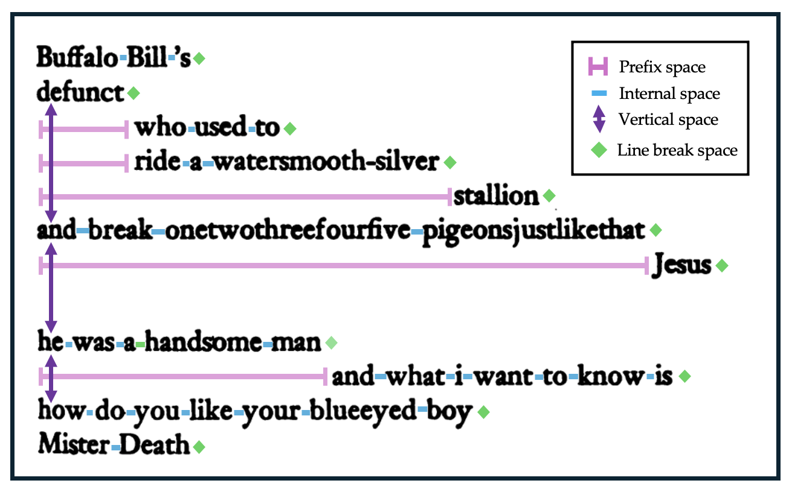
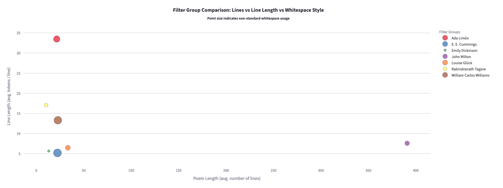

Code, dataset, and dashboard for the EMNLP paper **"so much depends / upon / a whitespace: Why Whitespace Matters for Poets and LLMs"**  

<p align="center">
    
</p>


## I. Public Domain Poems Dataset

`1-public_domain_poems` contains 2,857 whitespace-preserved public domain poems from the [Poetry Foundation](https://www.poetryfoundation.org/). The poems were selected based on their public domain status (author death year <= 1929) and processed to preserve poetic whitespace using our custom parsers for extracting HTML from webpages, and the [`resiliparse`](https://resiliparse.chatnoir.eu/en/stable/) HTML parser.

Please see the [1-public_domain_poems/README.md](./1-public_domain_poems/README.md) for more details about the dataset, including inclusion criteria, metadata fields, and explanation of the individual poem files in `.txt` and `.html` formats.

## II. Whitespace Patterns in Poetry: [poetry.darthbhyrava.com](https://poetry.darthbhyrava.com)

Explore whitespace patterns in poetry across 19,454 poems by 4331 poets from [The Poetry Foundation](https://www.poetryfoundation.org) in our interactive dashboard at [poetry.darthbhyrava.com](https://poetry.darthbhyrava.com).

<p align="center">
    
</p>

The dashboard allows you to visualize and analyze how poets use whitespace as a literary device, offering insights into the spatial dimensions of poetic expression. Browse through different poems, categories of poets, compare poet styles, and discover how formatting contributes to meaning and aesthetic effect.

## III. Poetry Screenshotter

A tool for capturing specific divs from HTML webpages to independent images. We use this to get ground truth images of poems from Poetry Foundation webpages. Please see the [2-poetry-screenshotter/README.md](./2-poetry-screenshotter/README.md) for more details about the package, including installation instructions and usage examples. Basic Usage after installation:

```bash
$ poetry-screenshotter convert poems/an-ode-to-ben-jonson.html -o poems/an-ode-to-ben-jonson.png 
```

## IV. WISP-Bench: Evaluating Whitespace Preservation Fidelity across Linearization methods.

When you convert a formatted whitespace-rich source text (like a poem) from HTML/Image/PDF/any-other-format to plain text, how can you quantify the quality of whitespace preservation fidelity? We propose WISP-Bench, a benchmark for evaluating whitespace preservation fidelity across different linearization methods.


## IV. Citation

This dataset supports the analysis in our paper:  
> “Whitespace.”

---

